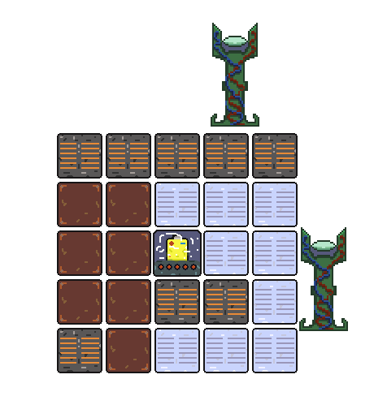
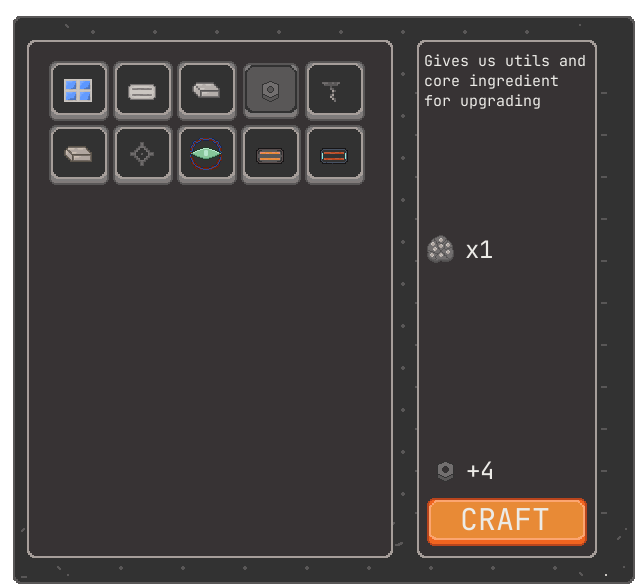
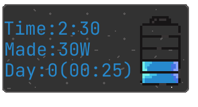
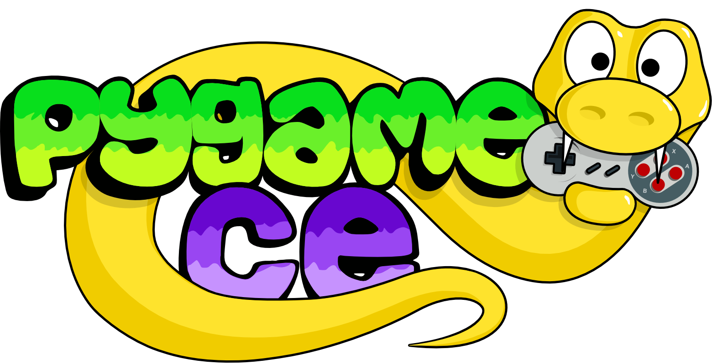

# Get Those Clankers!

#### The game about the rover. You have been sent to a mission to operate and own territory. Failure to do so will result in [...]. Survive through the days, as with each day becomes more difficult. Defend your heart through it all. As your only goal is be unstopable and learn what this territory has to bring to you.

## Defend
#### Explore the resources that it has and claim your land. Use your resources wisely. Those bots aren't gonna show mercy.

## Craft
#### with destruction, comes construction, gather items and craft in order to survive. Build the best of the latest tech avaliable

## Survive
#### Only Time will tell when the worse will happen

## Credits and Details

#### Created by the Team: THAT'S A PROMISE.
- **Julien - head of project**
- **Gurujezz - head of design**
- **MessyGear - assitant programmer and assitant designer**

Game created using python and pygame-ce library. No AI was used for coding or asset designing, **made with blood, sweat and tears.** Made for the [Pygame Summer Game Jam](https://itch.io/jam/the-long-pygame-summer-jam)

